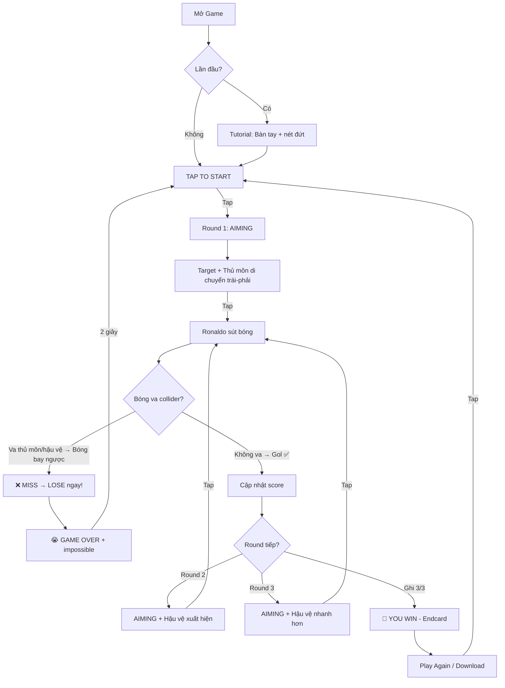

# 🎮 Ronaldo Penalty - Unity Game Plan

Game đá penalty theo phong cách casual mobile (portrait). Ronaldo sút 3 quả, target di chuyển liên tục, thủ môn & hậu vệ di chuyển để cản phá. Tham khảo game "Ronaldo Worldcup Penalty" trên TikTok filter.

---

## 📐 Tổng Quan Kiến Trúc

### Platform & Settings
- **Engine**: Unity 2022.3 LTS (hoặc mới hơn)
- **Orientation**: Portrait (9:16)
- **Render Pipeline**: URP (Universal Render Pipeline) — nhẹ, phù hợp mobile
- **Camera**: Perspective, góc nhìn từ sau lưng Ronaldo hướng về khung thành

### Cấu Trúc Folder Unity
```
Assets/
├── Scenes/
│   └── GameScene.unity          # Scene duy nhất
├── Scripts/
│   ├── GameManager.cs           # Quản lý flow game
│   ├── BallController.cs        # Điều khiển bóng bay
│   ├── TargetMover.cs           # Target di chuyển trái-phải
│   ├── GoalkeeperAI.cs          # Thủ môn di chuyển
│   ├── DefenderAI.cs            # Hậu vệ di chuyển (round 2,3)
│   ├── PlayerAnimator.cs        # Animation Ronaldo sút
│   ├── TutorialManager.cs       # Tutorial bàn tay + nét đứt
│   ├── UIManager.cs             # Quản lý UI (score, endcard, lose)
│   └── CameraShake.cs           # Rung camera khi sút
├── Prefabs/
│   ├── Ball.prefab
│   ├── Ronaldo.prefab
│   ├── Goalkeeper.prefab
│   ├── Defender.prefab
│   └── Goal.prefab
├── Materials/
├── Textures/
├── Animations/
├── Audio/
│   ├── kick.wav
│   ├── goal.wav
│   ├── miss.wav
│   └── crowd.wav
└── UI/
    ├── Sprites/
    │   ├── icon_check.png       # ✅
    │   ├── icon_cross.png       # ❌
    │   ├── icon_empty.png       # ⬜
    │   ├── hand_tutorial.png    # Bàn tay tutorial
    │   └── dashed_line.png      # Nét đứt
    └── Fonts/
```

---

## 🎯 Chi Tiết Từng Script

---

### 1. `GameManager.cs` — Bộ não của game

Quản lý toàn bộ flow game, trạng thái, và chuyển đổi giữa các phase.

```
Các State (dùng enum):
┌─────────────┐
│  TUTORIAL    │ ← Lần đầu chơi, hiện bàn tay vẽ nét đứt
├─────────────┤
│  WAITING     │ ← "Tap to Start" / Chờ người chơi tap
├─────────────┤
│  AIMING      │ ← Target đang di chuyển, chờ người chơi tap để sút
├─────────────┤
│  SHOOTING    │ ← Bóng đang bay
├─────────────┤
│  RESULT      │ ← Kiểm tra gol hay miss
├─────────────┤
│  WIN         │ ← Hiện Endcard
├─────────────┤
│  LOSE        │ ← Hiện màn lose, 2s rồi reset
└─────────────┘
```

**Biến quan trọng:**
| Biến | Kiểu | Mô tả |
|------|-------|--------|
| `currentRound` | int | Round hiện tại (1-3) |
| `shotResults[]` | bool[3] | Kết quả 3 lần sút (true=gol) |
| `goalsScored` | int | Số bàn ghi được |
| `goalsMissed` | int | Số bàn miss |
| `isFirstPlay` | bool | Lần đầu chơi (show tutorial) |

**Logic chính:**
```
OnTapToStart():
    if isFirstPlay → show Tutorial → sau tutorial xong → chuyển AIMING
    else → chuyển AIMING

OnAiming():
    TargetMover.StartMoving()
    GoalkeeperAI.StartMoving()
    if currentRound >= 2 → DefenderAI.SetActive(true) + StartMoving()

OnPlayerTap():  // Khi người chơi tap để sút
    targetPosition = TargetMover.GetCurrentPosition()
    TargetMover.StopMoving()
    PlayKickAnimation()
    BallController.Shoot(targetPosition)
    State = SHOOTING

OnBallResult():
    Cập nhật shotResults[currentRound]
    Cập nhật UI (✅ hoặc ❌)
    
    currentRound++
    
    if goalsMissed >= 1 → State = LOSE    // Miss 1 là thua ngay!
    elif currentRound > 3 → State = WIN   // Ghi 3/3 → Win
    else → delay 1s → State = AIMING      // Round tiếp
```

> [!CAUTION]
> **Điều kiện Win/Lose**: Phải ghi **3/3 bàn** mới thắng. Miss 1 quả bất kỳ → Thua ngay lập tức → Hiện màn Lose.

---

### 2. `TargetMover.cs` — Đích đến di chuyển

Target (dấu chấm/crosshair) di chuyển qua lại giữa 2 điểm trên mặt phẳng khung thành.

```csharp
// Concept code
public class TargetMover : MonoBehaviour
{
    [SerializeField] Transform leftPoint;    // Điểm trái khung thành
    [SerializeField] Transform rightPoint;   // Điểm phải khung thành
    [SerializeField] float speed = 2f;       // Tốc độ di chuyển
    
    private bool isMoving = false;
    private float t = 0;                     // Lerp parameter
    private int direction = 1;               // 1 = phải, -1 = trái
    
    void Update()
    {
        if (!isMoving) return;
        
        t += direction * speed * Time.deltaTime;
        
        if (t >= 1f) { t = 1f; direction = -1; }
        if (t <= 0f) { t = 0f; direction = 1; }
        
        // Dùng SmoothStep cho chuyển động mượt hơn ở 2 đầu
        float smoothT = Mathf.SmoothStep(0, 1, t);
        transform.position = Vector3.Lerp(leftPoint.position, rightPoint.position, smoothT);
    }
    
    public Vector3 GetCurrentPosition() => transform.position;
}
```

**Visual**: Target hiển thị như hình tròn nhỏ hoặc crosshair, có thể dùng Sprite hoặc UI element chiếu lên mặt sân gần khung thành.

**Tăng độ khó theo round:**
| Round | Speed | Ghi chú |
|-------|-------|---------|
| 1 | 2.0 | Chậm, dễ aim |
| 2 | 2.8 | Nhanh hơn |
| 3 | 3.5 | Nhanh nhất |

---

### 3. `BallController.cs` — Vật lý bóng bay

Đây là script quan trọng nhất, quyết định cảm giác gameplay.

**Nguyên lý hoạt động:**

```
                    Khung thành
    ┌──────────────────────────────────┐
    │          ↗ Bổng (cao)            │
    │        ↗                         │
    │      ↗  Hơi bổng                 │
    │    →  Bay sệt (giữa)            │
    │      ↘  Hơi bổng                 │
    │        ↘                         │
    │          ↘ Bổng (cao)            │
    └──────────────────────────────────┘
    
    ← TRÁI ────── GIỮA ────── PHẢI →
```

**Logic tính quỹ đạo bóng:**

```csharp
public void Shoot(Vector3 targetPos)
{
    Vector3 goalCenter = goalTransform.position;  // Tâm khung thành
    
    // Tính độ lệch so với tâm (0 = giữa, 1 = sát cột)
    float offsetX = (targetPos.x - goalCenter.x) / goalHalfWidth;
    float normalizedOffset = Mathf.Abs(offsetX);  // 0..1
    
    // Tính độ cao dựa trên độ lệch
    // Giữa → sệt (height ≈ 0.1), Rìa → bổng (height ≈ 2.5)
    float maxHeight = Mathf.Lerp(0.1f, 2.5f, normalizedOffset * normalizedOffset);
    
    // Tạo quỹ đạo bóng dùng Animation Curve hoặc tính tay
    StartCoroutine(FlyBall(targetPos, maxHeight));
}

IEnumerator FlyBall(Vector3 target, float maxHeight)
{
    Vector3 start = transform.position;
    float flightTime = 0.8f;  // Thời gian bay
    float elapsed = 0;
    
    while (elapsed < flightTime)
    {
        elapsed += Time.deltaTime;
        float t = elapsed / flightTime;
        
        // Lerp vị trí X, Z (tiến về phía trước)
        Vector3 pos = Vector3.Lerp(start, target, t);
        
        // Parabolic height: y = 4h * t * (1-t)
        pos.y = start.y + maxHeight * 4f * t * (1f - t);
        
        transform.position = pos;
        
        // Xoay bóng cho thực tế
        transform.Rotate(Vector3.right, 720 * Time.deltaTime);
        
        yield return null;
    }
    
    // === BOUNCE (nảy) ===
    if (maxHeight < 0.5f)  // Chỉ nảy khi sút sệt
    {
        // Nảy nhỏ sau khi chạm sân
        yield return StartCoroutine(Bounce(target));
    }
    
    // Thông báo bóng đã tới (GOL!)
    OnBallArrived?.Invoke();
}

IEnumerator Bounce(Vector3 landPos)
{
    float bounceHeight = 0.3f;
    float bounceTime = 0.25f;
    float elapsed = 0;
    Vector3 bounceTarget = landPos + Vector3.forward * 0.5f;
    
    while (elapsed < bounceTime)
    {
        elapsed += Time.deltaTime;
        float t = elapsed / bounceTime;
        
        Vector3 pos = Vector3.Lerp(landPos, bounceTarget, t);
        pos.y = bounceHeight * 4f * t * (1f - t);  // Parabolic nhỏ
        
        transform.position = pos;
        yield return null;
    }
}

// === BÓNG BAY NGƯỢC KHI VA COLLIDER ===
// Gắn trên Ball, dùng OnTriggerEnter hoặc OnCollisionEnter
void OnTriggerEnter(Collider other)
{
    if (other.CompareTag("Goalkeeper") || other.CompareTag("Defender"))
    {
        // Dừng coroutine bay về phía trước
        StopAllCoroutines();
        
        // Tính hướng ngược lại
        Vector3 reflectDir = (transform.position - other.transform.position).normalized;
        reflectDir.y = 0.3f;  // Hơi bổng lên khi nảy ngược
        
        // Bay ngược lại
        StartCoroutine(BounceBack(reflectDir));
        
        // Thông báo MISS
        OnBallBlocked?.Invoke();
    }
}

IEnumerator BounceBack(Vector3 direction)
{
    float bounceBackTime = 0.6f;
    float speed = 8f;
    float elapsed = 0;
    
    while (elapsed < bounceBackTime)
    {
        elapsed += Time.deltaTime;
        float t = elapsed / bounceBackTime;
        
        // Giảm tốc dần
        float decel = 1f - t;
        transform.position += direction * speed * decel * Time.deltaTime;
        
        // Trọng lực kéo xuống
        direction.y -= 9.8f * Time.deltaTime;
        
        // Xoay bóng ngược
        transform.Rotate(Vector3.right, -540 * Time.deltaTime);
        
        yield return null;
    }
}
```

**Bảng tham số quỹ đạo:**

| Vị trí sút | normalizedOffset | maxHeight | Hiệu ứng |
|-------------|-----------------|-----------|-----------|
| Giữa | 0.0 - 0.2 | 0.1 - 0.3m | Bay sệt, nảy nhẹ |
| Hơi lệch | 0.2 - 0.5 | 0.3 - 1.0m | Hơi bổng |
| Lệch nhiều | 0.5 - 0.8 | 1.0 - 2.0m | Bổng rõ |
| Sát cột | 0.8 - 1.0 | 2.0 - 2.5m | Bổng cao, khó bắt |

> [!TIP]
> Dùng `AnimationCurve` trong Inspector thay vì code cứng sẽ giúp bạn tinh chỉnh quỹ đạo bóng dễ dàng hơn rất nhiều. Kéo curve trong Editor là thấy ngay kết quả.

---

### 4. `GoalkeeperAI.cs` — Thủ Môn

Thủ môn **chỉ di chuyển qua lại** giữa 2 cột liên tục, không cần dive hay dự đoán hướng bóng. Cản phá hoàn toàn dựa vào **collision physics**.

```
Hành vi duy nhất:
Di chuyển trái-phải liên tục (ping-pong giữa 2 cột)
Không dừng lại khi bóng được sút
Không dive hay nhảy
```

**Script đơn giản (tương tự TargetMover):**

```csharp
public class GoalkeeperAI : MonoBehaviour
{
    [SerializeField] Transform leftPost;     // Cột trái
    [SerializeField] Transform rightPost;    // Cột phải
    [SerializeField] float speed = 1.5f;
    
    private float t = 0;
    private int direction = 1;
    
    void Update()
    {
        t += direction * speed * Time.deltaTime;
        
        if (t >= 1f) { t = 1f; direction = -1; }
        if (t <= 0f) { t = 0f; direction = 1; }
        
        float smoothT = Mathf.SmoothStep(0, 1, t);
        transform.position = Vector3.Lerp(leftPost.position, rightPost.position, smoothT);
    }
}
```

**Collision — Bóng bay ngược lại:**
- Đặt **Collider** (CapsuleCollider/BoxCollider) + **Rigidbody (isKinematic = true)** trên thủ môn
- Khi bóng chạm collider thủ môn → **bóng bay ngược lại** (reflect direction)
- Xem chi tiết logic reflect ở phần `BallController.cs` bên dưới

| Round | Patrol Speed | Ghi chú |
|-------|-------------|--------|
| 1 | 1.5 | Chậm, dễ tránh |
| 2 | 2.0 | Nhanh hơn |
| 3 | 2.5 | Nhanh nhất |

---

### 5. `DefenderAI.cs` — Hậu Vệ (Round 2 & 3)

Hậu vệ đứng giữa Ronaldo và khung thành, di chuyển trái-phải để chắn bóng. Xuất hiện từ **Round 2**.

```
Vị trí: Khoảng 40-50% khoảng cách từ Ronaldo đến khung thành
Di chuyển: Ping-pong trái phải, phạm vi hẹp hơn thủ môn
Script: Gần giống GoalkeeperAI (cùng pattern ping-pong)
```

**Collision — Bóng bay ngược lại:**
- Đặt **Collider** (BoxCollider hoặc CapsuleCollider) + **Rigidbody (isKinematic = true)** trên hậu vệ
- Bóng chạm collider hậu vệ → **bóng bay ngược lại** (reflect), giống logic thủ môn
- Kết quả: Miss → Lose ngay

**Tăng độ khó:**

| Round | Số hậu vệ | Speed | Phạm vi |
|-------|-----------|-------|---------|
| 1 | 0 | — | — |
| 2 | 1 | 2.0 | Hẹp (40% khung thành) |
| 3 | 1 (nhanh hơn) | 3.0 | Rộng hơn (60% khung thành) |

> [!NOTE]
> Có thể thêm hậu vệ thứ 2 ở round 3 nếu muốn tăng độ khó. Dễ mở rộng vì dùng cùng script.

---

### 6. `TutorialManager.cs` — Tutorial Bàn Tay

Hiện ở lần chơi đầu tiên, hướng dẫn người chơi tap để sút.

```
Flow Tutorial:
1. Hiện bàn tay (sprite) ở dưới màn hình
2. Bàn tay di chuyển lên trên, vẽ đường nét đứt từ bóng → khung thành
3. Nét đứt xuất hiện dần theo bàn tay (dùng LineRenderer hoặc nhiều sprite nối)
4. Khi bàn tay tới khung thành → flash/pulse hiệu ứng
5. Đợi 1s → ẩn tutorial
6. Callback → GameManager chuyển sang AIMING
```

**Cách làm nét đứt:**
- **Option 1 (đơn giản)**: Dùng UI Image với sprite nét đứt, animate alpha + scale
- **Option 2 (đẹp hơn)**: Dùng `LineRenderer` với material nét đứt (dash texture), animate endpoint

**Lưu ý**: Dùng `PlayerPrefs.SetInt("TutorialDone", 1)` để chỉ hiện tutorial lần đầu.

---

### 7. `UIManager.cs` — Giao Diện

#### Layout UI (từ trên xuống):

```
┌─────────────────────────────────────┐
│                                     │
│        [❌] [⬜] [⬜]              │  ← Score Indicators
│                                     │
│                                     │
│          ┌───────────┐              │
│          │  KHUNG    │              │  ← 3D Scene
│          │  THÀNH    │              │
│          │           │              │
│          └───────────┘              │
│                                     │
│            ⚽ ← Target              │
│                                     │
│                                     │
│                                     │
│         🧑 Ronaldo                  │
│                                     │
│        "TAP TO KICK"                │  ← Prompt text
│                                     │
└─────────────────────────────────────┘
```

#### Score Indicators (trên cùng):
- 3 ô vuông nằm ngang, mỗi ô đại diện 1 lần sút
- Trạng thái: ⬜ (chưa sút) → ✅ (gol) hoặc ❌ (miss)
- Dùng UI Image, swap sprite khi có kết quả

#### Màn Win (Endcard):

```
┌─────────────────────────────────────┐
│                                     │
│           🎉 YOU WIN! 🎉           │
│                                     │
│         [✅] [✅] [✅]             │
│                                     │
│      ┌─────────────────────┐        │
│      │                     │        │
│      │   Ronaldo ăn mừng   │        │
│      │   (Animation)       │        │
│      │                     │        │
│      └─────────────────────┘        │
│                                     │
│      ┌─────────────────────┐        │
│      │    PLAY AGAIN ▶     │        │
│      └─────────────────────┘        │
│                                     │
│         ⬇ DOWNLOAD NOW ⬇           │  ← CTA (nếu là playable ad)
│                                     │
└─────────────────────────────────────┘
```

#### Màn Lose:

Hiện ngay khi miss 1 quả bất kỳ (round 1, 2, hoặc 3).

```
┌─────────────────────────────────────┐
│                                     │
│         😭 GAME OVER 😭            │
│                                     │
│  (Score tùy round miss, ví dụ:)    │
│  Round 1 miss: [❌] [⬜] [⬜]     │
│  Round 2 miss: [✅] [❌] [⬜]     │
│  Round 3 miss: [✅] [✅] [❌]     │
│                                     │
│        "impossible 😭"              │
│                                     │
│   (Bóng bay ngược lại trên sân)    │
│                                     │
│   (Tự động chuyển về gameplay       │
│    sau 2 giây)                      │
│                                     │
│        "TAP TO START"               │
│                                     │
└─────────────────────────────────────┘
```

**Flow Lose:**
1. Hiện overlay "GAME OVER" + "impossible 😭"
2. `yield return new WaitForSeconds(2f);`
3. Ẩn overlay
4. Reset game (`GameManager.ResetGame()`)
5. Hiện "TAP TO START"

---

### 8. `PlayerAnimator.cs` — Animation Ronaldo

```
Animations cần:
1. Idle         → Đứng chờ, hơi nhún nhẹ
2. RunUp        → Chạy đà lên bóng (ngắn, ~0.5s)
3. Kick         → Sút bóng
4. Celebrate    → Ăn mừng (khi gol)
5. Disappointed → Thất vọng (khi miss)
```

> [!TIP]
> Nếu không có animator, có thể dùng sprite 2D chibi style như trong hình tham khảo. Đơn giản hơn nhiều so với 3D animation.

---

### 9. `CameraShake.cs` — Hiệu Ứng Camera

Rung camera nhẹ khi sút bóng để tăng cảm giác impact.

```csharp
public IEnumerator Shake(float duration = 0.2f, float magnitude = 0.1f)
{
    Vector3 originalPos = transform.localPosition;
    float elapsed = 0;
    
    while (elapsed < duration)
    {
        float x = Random.Range(-1f, 1f) * magnitude;
        float y = Random.Range(-1f, 1f) * magnitude;
        transform.localPosition = originalPos + new Vector3(x, y, 0);
        elapsed += Time.deltaTime;
        yield return null;
    }
    
    transform.localPosition = originalPos;
}
```

---

## 🔄 Flow Game Hoàn Chỉnh



---

## 🎨 Về Asset / Đồ Họa

### Option A: 2D Chibi Style (Khuyến nghị — như hình tham khảo)
- Dùng **Sprite 2D** cho nhân vật (chibi Ronaldo, thủ môn, hậu vệ)
- Sân bóng dùng sprite nền hoặc tilemap đơn giản
- Khung thành dùng sprite
- Bóng dùng sprite với scale animation
- **Ưu điểm**: Nhanh, nhẹ, dễ làm, phù hợp playable ad
- **Nguồn asset**: Tự vẽ, thuê vẽ, hoặc dùng AI generate

### Option B: 3D Low Poly
- Dùng model 3D low poly
- Cần thêm animation 3D
- **Ưu điểm**: Nhìn chuyên nghiệp hơn
- **Nhược điểm**: Mất thời gian hơn, nặng hơn

> [!IMPORTANT]
> Bạn muốn làm theo style nào? **2D chibi** (như hình tham khảo, nhanh hơn) hay **3D low poly** (đẹp hơn nhưng mất thời gian)?

---

## 📋 Checklist Thực Hiện (Theo Thứ Tự)

### Phase 1: Setup Cơ Bản (Ngày 1)
- [ ] Tạo Unity Project mới (URP, Portrait)
- [ ] Setup scene: Camera, Lighting
- [ ] Tạo sân bóng (plane + material hoặc sprite)
- [ ] Tạo khung thành (model/sprite)
- [ ] Đặt bóng tại vị trí penalty

### Phase 2: Core Mechanics (Ngày 2-3)
- [ ] `TargetMover.cs` — Target di chuyển trái-phải
- [ ] `BallController.cs` — Bóng bay theo quỹ đạo (sệt/bổng)
- [ ] Implement tap để sút
- [ ] Test quỹ đạo bóng, tinh chỉnh curve

### Phase 3: Nhân Vật & Collision (Ngày 3-4)
- [ ] `GoalkeeperAI.cs` — Thủ môn patrol trái-phải (không dive)
- [ ] `DefenderAI.cs` — Hậu vệ di chuyển chắn (cùng pattern)
- [ ] Setup Collider + Tag trên thủ môn và hậu vệ
- [ ] `BallController` — Logic bóng bay ngược khi va collider
- [ ] Test: bóng nảy ngược trông tự nhiên

### Phase 4: Game Flow (Ngày 4-5)
- [ ] `GameManager.cs` — State machine
- [ ] Hệ thống 3 round
- [ ] Round 2,3 enable hậu vệ
- [ ] Tăng difficulty mỗi round
- [ ] Logic Win/Lose

### Phase 5: UI & Polish (Ngày 5-6)
- [ ] `UIManager.cs` — Score indicators (✅❌⬜)
- [ ] Màn Win (Endcard)
- [ ] Màn Lose + auto-reset 2s
- [ ] "TAP TO START" / "TAP TO KICK"
- [ ] `TutorialManager.cs` — Bàn tay + nét đứt

### Phase 6: Juice & Feel (Ngày 6-7)
- [ ] `CameraShake.cs`
- [ ] Particle effects: bụi khi sút, confetti khi win
- [ ] Sound effects: sút, vào lưới, miss, đám đông
- [ ] Screen flash khi gol
- [ ] Animation Ronaldo (idle, kick, celebrate)

### Phase 7: Test & Polish (Ngày 7+)
- [ ] Test trên điện thoại thật
- [ ] Tinh chỉnh difficulty balance
- [ ] Tinh chỉnh quỹ đạo bóng cho "feel" tốt
- [ ] Fix bugs
- [ ] Build final

---

## ⚙️ Các Tip Kỹ Thuật Quan Trọng

### 1. Collision Detection — Bóng Bay Ngược
```
Setup:
- Ball: SphereCollider (isTrigger = true) + Rigidbody (isKinematic = true)
- Goalkeeper: CapsuleCollider (isTrigger = true) + Rigidbody (isKinematic = true)
- Defender: BoxCollider (isTrigger = true) + Rigidbody (isKinematic = true)

Khi bóng chạm collider thủ môn/hậu vệ:
→ OnTriggerEnter được gọi trên BallController
→ Dừng coroutine bay về phía trước (StopAllCoroutines)
→ Tính hướng reflect: (ball.pos - blocker.pos).normalized
→ Thêm chút Y (0.3) để bóng hơi bổng lên khi nảy ngược
→ Chạy coroutine BounceBack (bay ngược + giảm tốc + trọng lực)
→ Gọi event OnBallBlocked → GameManager xử lý LOSE

Khi bóng KHÔNG chạm gì và tới goal line:
→ GOL! → GameManager xử lý score
```

### 2. Cách Tạo Cảm Giác "Juicy"
- **Slow motion** 0.3s khi bóng sắp vào lưới (`Time.timeScale = 0.3f`)
- **Zoom camera** nhẹ khi sút
- **Trail Renderer** trên bóng khi bay
- **Particle burst** khi bóng chạm lưới

### 3. Responsive Portrait Layout
```csharp
// Tự động scale theo tỉ lệ màn hình
float targetAspect = 9f / 16f;
float currentAspect = (float)Screen.width / Screen.height;
Camera.main.fieldOfView = Mathf.Lerp(60, 75, 
    Mathf.InverseLerp(targetAspect, 0.5f, currentAspect));
```

---

## Open Questions

> [!IMPORTANT]
> **1. Phong cách đồ họa**: 2D chibi sprite (nhanh, như hình tham khảo) hay 3D low poly (đẹp hơn nhưng lâu hơn)?

> [!NOTE]
> **2. Đây có phải playable ad không?** Nếu có, cần thêm CTA button "Download Now" ở endcard và giới hạn dung lượng.

> [!NOTE]
> **3. Hậu vệ round 2 vs round 3**: Có muốn 2 hậu vệ ở round 3 không, hay chỉ 1 hậu vệ nhưng nhanh hơn?
